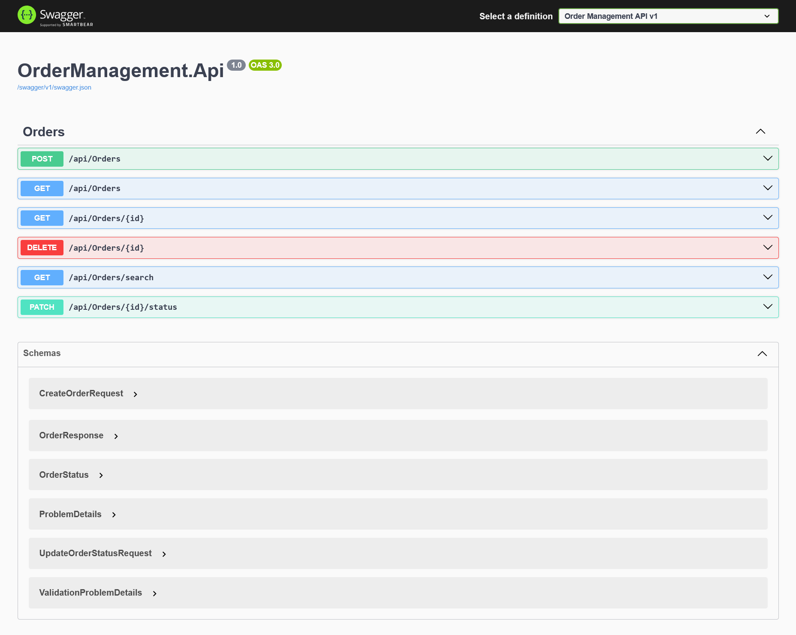
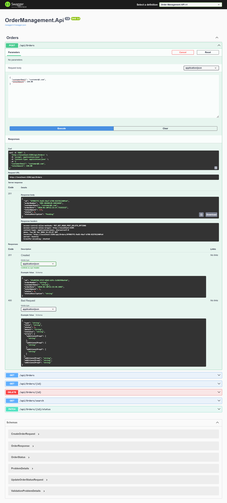
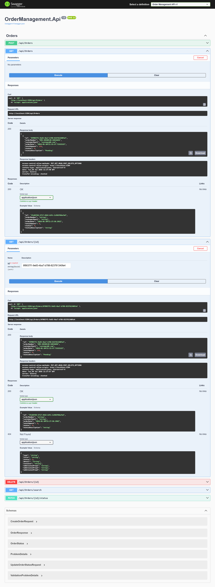
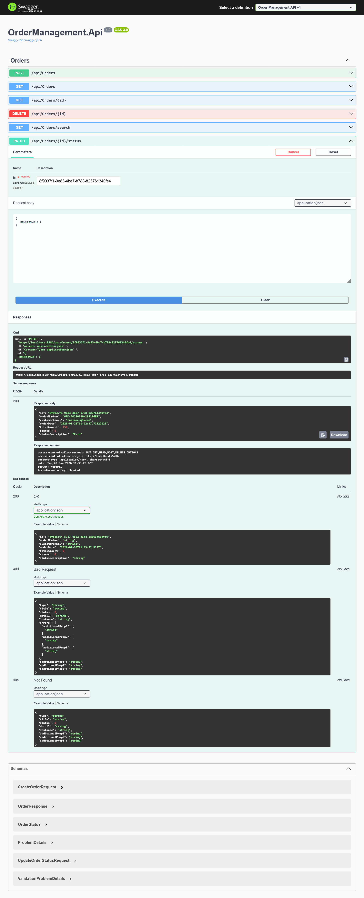
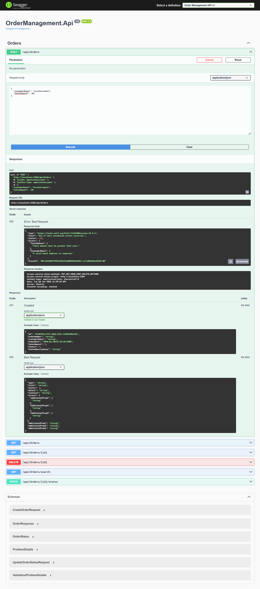
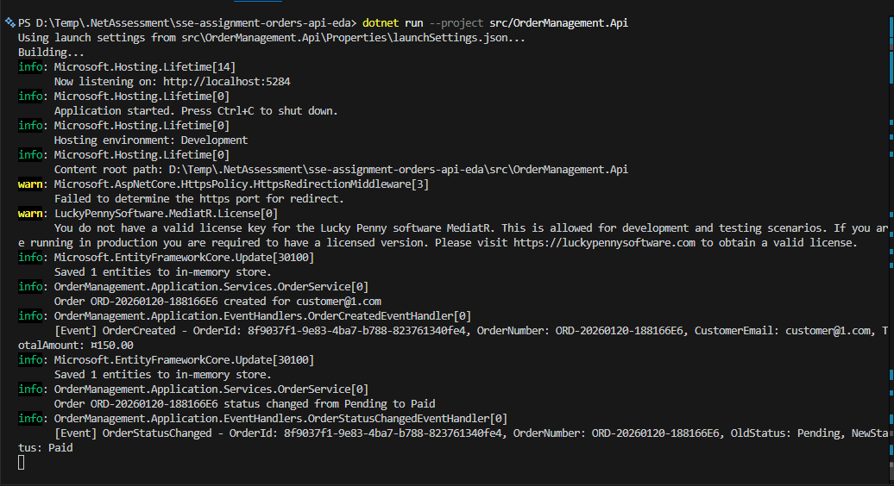
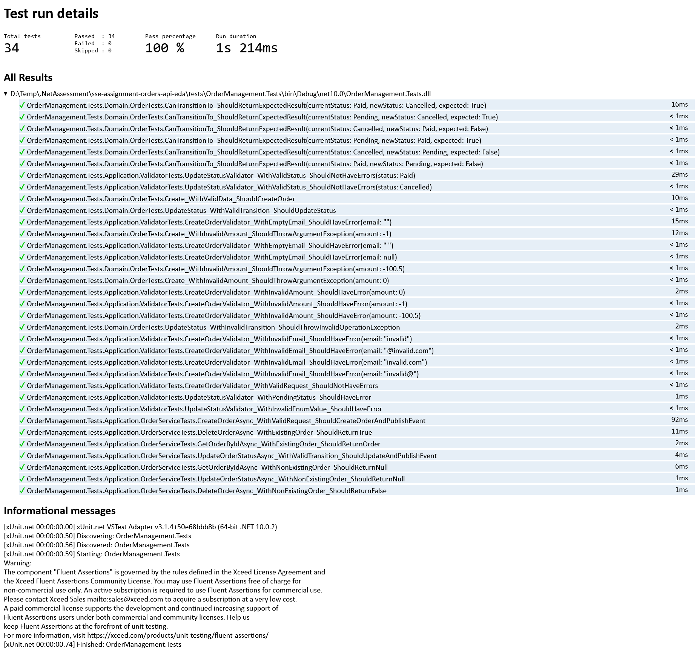

# Order Management API

ASP.NET Core Web API (.NET 10) for managing orders with event-driven architecture.

## Screenshots

### Swagger UI


### API Testing

| Test | Screenshot |
|------|------------|
| Create Order (201) |  |
| Get All Orders (200) |  |
| Update Status (200) |  |
| Validation Error (400) |  |

### Domain Events Logging


### Test Results


📄 [View Full Test Report](tests/OrderManagement.Tests/TestResults/TestResults.html)

---

## Quick Start

```bash
# Run the API
dotnet run --project src/OrderManagement.Api

# Run tests
dotnet test
```

Access Swagger UI at: `https://localhost:{port}/swagger`

## API Endpoints

| Method | Endpoint | Description |
|--------|----------|-------------|
| POST | `/api/orders` | Create order (201) |
| GET | `/api/orders` | Get all orders (200) |
| GET | `/api/orders/{id}` | Get by ID (200/404) |
| GET | `/api/orders/search` | Search with filters (200) |
| PATCH | `/api/orders/{id}/status` | Update status (200/400/404) |
| DELETE | `/api/orders/{id}` | Delete order (204/404) |

## Design Decisions

**Clean Architecture** - Four separate projects ensuring separation of concerns:
- `Domain` - Entities, enums, domain events (zero dependencies)
- `Application` - Services, DTOs, validators, event handlers
- `Infrastructure` - EF Core DbContext, repositories
- `Api` - Controllers, middleware

**MediatR for Events** - Industry-standard in-memory event bus. Domain events (`OrderCreated`, `OrderStatusChanged`) are published via `IMediator.Publish()` and handled by notification handlers with logging.

**Repository + Unit of Work** - Abstracts data access, enables testability, manages transactions.

**FluentValidation** - Clean, testable validation separate from DTOs.

## Assumptions

- Order numbers are auto-generated (`ORD-{date}-{random}`)
- `OrderDate` is always stored/returned in UTC
- Status transitions: Pending → Paid/Cancelled, Paid → Cancelled (no reverting to Pending)
- In-memory database resets on restart

## Potential Improvements

- Replace InMemory with SQL Server/PostgreSQL for persistence
- Add pagination to list endpoints
- Implement real message broker (RabbitMQ/Kafka) for distributed events
- Add CQRS pattern for read/write separation
- Implement Outbox pattern for reliable event publishing
- Add authentication/authorization
- Add integration tests with WebApplicationFactory
